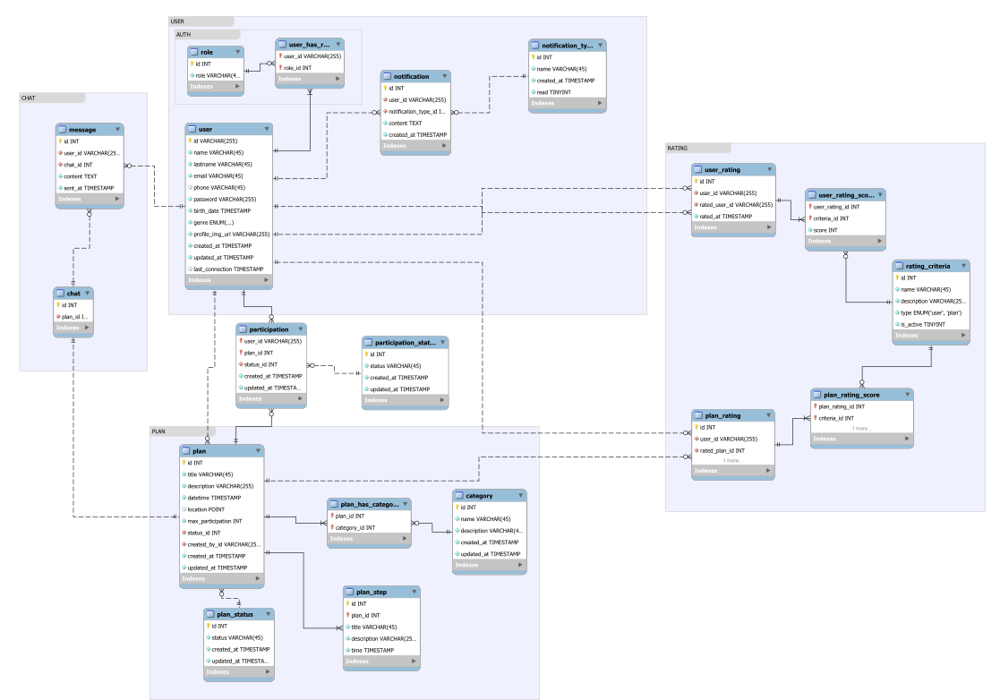

# Presentación **No Plan**
## Índice
1. [Introducción](#introducción)
2. [Casos de uso](#casos-de-uso)
3. [Estructura BBDD (ERM)](#estructura-bbdd-erm)
    1. [Diagrama](#diagrama)
    2. [Cardinalidades](#cardinalidades)
4. [UI / UX](#ui--ux)
    1. [Usabilidad](#usabilidad)
    2. [Mockup](#mockup)
    3. [Diagrama de flujo](#diagrama-de-flujo)
5. [Estructura del código](#estructura-del-código)
    1. [Carpetas y módulos](#carpetas-y-módulos)
    2. [Backend](#backend)
        1. [Diagrama de flujo](#diagrama-de-flujo-1)
        2. [Componetización y desacoplamiento](#componetización-y-desacoplamiento)
            1. [DDD (Domain-Driven Design)](#ddd-domain-driven-design)
            2. [Comunicación entre capas](#comunicación-entre-capas)
            3. [Acoplamiento parcial](#acoplamiento-parcial)
        3. [Router](#router)
        4. [API](#api)
        5. [PHP Docs](#php-docs)
    3. [Frontend](#frontend)
        1. [Diagrama de flujo](#diagrama-de-flujo-2)
        2. [AJAX](#ajax)
        3. [Componentes reactivos](#componentes-reactivos)
6. [Backend](#backend)
7. [Frontend](#frontend)

# Introducción
Tienes un plan pero nadie con quien compartirlo? Te apetece salir de casa pero no tienes plan?
**No Plan** es una aplicación web en la que los usuarios podrán unirse a planes creados por otros usuarios así como crear los suyos propios y compartir experiencias. 

# Casos de uso
#### Como **organizadores**:
- Crear planes y publicarlos (ir a un museo, asistir a un concierto, jugar a videojuegos, hacer hiking, organizar una barbacoa, un día en la playa, etc.). 
- El usuario podrá definir el mínimo y el máximo número de participantes.
- Aceptar o rechazar participaciones (otros usuarios que quieran unirse).
- Invitar a otros usuarios a sus planes.
- Comunicarse a través del chat del plan con los otros participantes (nodejs / socketio).
- Puntuar a los participantes del plan una vez finalizado.
- Duplicar planes ya realizados para publicarlos con una nueva fecha.

#### Como **participantes**:
- Revisar los planes propuestos por la app de manera personalizada en base a criterios de uso y ubicación.
- Buscar planes, a través de un buscador, en base a criterios y filtros como cercanía, fecha, categoría, tipo o número de participantes, organizador, etc.
- Buscar planes cercanos en un mapa (leaflet.js)
- Enviar solicitudes para participar en planes.
- Comunicarse a través del chat del plan con el organizador y los demás participantes.
- Puntuar el plan y al resto de participantes una vez finalizado.

#### Futuras implementaciones:
- Acceder a un chat grupal por plan.
- Seguir a otros usuarios y recibir notificaciones para estar al día de sus planes.
- Compartir en redes sociales los planes en los que se participará, se ha participado o se está participando.
- Subir contenido multimedia (fotos en un principio) durante y después de la realización de la actividad.
- Enviar feedback sobre la aplicación.
- Reportar un problema.
- Ver FAQs y ayuda.
- Contactar con soporte.

# Estructura BBDD (ERM)
## Diagrama



Pulsa [aquí](./Diagramas/ERM.svg) para ver el diagrama completo.

## Cardinalidades

- Un **usuario** tiene uno o muchos **roles**.
- Un **rol** puede tener 0 o muchos **usuarios**.
- Un **usuario** puede crear 0 o muchos **planes**.
- Un **plan** solo puede tener un **usuario** creador.
- Un **usuario** puede participar en 0 o muchos **planes**.
- Un **plan** puede tener uno o muchos **participantes**.
- Un **usuario** puede tener 0 o muchas **notificaciones**.
- Una **notificación** solo puede ser de un **usuario**.
- Un **plan** puede tener una o muchas **categorías**.
- Una **categoría** puede estar en 0 o muchos **planes**.
- Un **plan** puede tener uno o muchos **pasos**.
- Un **paso** pertenece a uno y solo un **plan**.
- Un **plan** tiene uno y solo un **chat**.
- Un **chat** pertenece a uno y solo un **plan**.

El módulo de rating ha de ser modificado y tiene algunos errores en su estructura que no han sido resueltos, por lo tanto no haré referencia a él.

# UI / UX
## Usabilidad
Esta aplicación está diseñada principalmente para dispositivos móviles, con planes futuros de portarla a **React Native** para su distribución a través de las tiendas de aplicaciones. Por ello, la interfaz de usuario y la experiencia de usuario (UI/UX) están adaptadas a este propósito. Actualmente, queda pendiente la implementación de **listeners** para eventos gestuales, por lo que lo que tenemos ahora mismo es un **Producto Mínimo Viable (PMV)**, o casi una prueba de concepto.
## Mockup


# Estructura del código
## Carpetas y módulos
La aplicación se separa en varios módulos que permiten ampliarla gradualmente y hacerla más mantenible y escalable.

- `Core`
- `Auth`
- `User`
- `Plan`
- `Participation`
- `Notification`

Más adelante se ampliará con los módulos.
- `Chat`
- `Rating`
- `Geolocation`
- `Admin`

## Backend
### Diagrama de flujo


### Componetización y desacoplamiento
#### DDD (Domain-Driven Design)
La aplicación se basa en el patrón de arquitectura de **Diseño Dirigido por el Dominio (DDD)**. La clave es el desacoplamiento entre las diferentes capas para garantizar escalabilidad y mantenibilidad. La aplicación está estructurada en módulos independientes y autónomos. Cada módulo consta de tres capas.


**Dominio**
Esta capa contiene las entidades del dominio, que son el núcleo de la aplicación. Ejemplos de estas entidades incluyen: `Plan`, `Participación`, `Notificación`, `Usuario`, etc. Estas entidades representan el dominio de la aplicación y sirven como base.  Las entidades de dominio se construyen como objetos simples que transfieren datos entre capas (similar a los DTO o Data Transfer Objects).

**Aplicación**
En esta capa reside la lógica de negocio, incluyendo los casos de uso y servicios que permiten manipular las entidades del dominio. Ejemplos de esta capa serían: `CreatePlanUseCase`, `SendNotificationUseCase`, `RegisterUserService`, etc.

**Infraestructura**
En esta capa se encuentran las clases que interactúan con dependencias externas, como bibliotecas, bases de datos, repositorios y controladores entre otros.

#### Comunicación entre capas
La comunicación entre capas es **unidireccional**. La capa de dominio no tiene conocimiento de la capa de aplicación, y la capa de aplicación no tiene conocimiento de la infraestructura.  

Estas capas solo interactúan de afuera hacia adentro, a través de abstracciones, lo que permite que los componentes sean intercambiables y estén completamente desacoplados, siempre que se respete el contrato establecido.

```bash
`Framework` >> `Infraestructura` >> `Aplicación` >> `Dominio`
```
#### Acoplamiento parcial
En la aplicación, existe un acoplamiento entre varios módulos y el módulo de notificaciones, ya que en ciertos eventos es necesario invocar casos de uso de dicho módulo.  
Se resolverá este acoplamiento en el futuro mediante la implementación de un sistema de eventos de dominio, como RabbitMQ. Esto permitirá que los casos de uso emitan eventos y se suscriban a las notificaciones de dichos eventos para disparar otros casos de uso.
### Router
Uno de los componentes clave en la estructura del backend es el **router**. La funcionalidad se divide en dos clases: `Router.php` y `Routes.php`.

**Routes.php**
Esta clase se encarga de registrar todas las rutas, asignando tres elementos a cada una:
1. Una función estática en un controlador.
2. Una instancia de la lógica de negocio (caso de uso o servicio).
3. Un tipo de acceso (público o privado).

**Router.php**
Esta clase se ocupa de parsear la URL, recuperar las variables correspondientes a la ruta e instanciar las clases necesarias para ejecutar la lógica de negocio. También verifica, en el caso de que el acceso a la ruta sea privado, si el usuario tiene los permisos adecuados.
### API

#### **Autenticación**

##### Iniciar Sesión
- **Endpoint:** `POST /login`
- **Acceso:** Público
- **Descripción:** Autentica a un usuario e inicia una sesión.

##### Cerrar Sesión
- **Endpoint:** `GET /logout`
- **Acceso:** Privado
- **Descripción:** Finaliza la sesión actual del usuario.

##### Verificar Existencia de Email
- **Endpoint:** `GET /email-exists`
- **Acceso:** Público
- **Descripción:** Comprueba si un email ya existe en el sistema.

##### Verificar Estado de Autenticación
- **Endpoint:** `GET /is-authenticated`
- **Acceso:** Público
- **Descripción:** Verifica si el usuario actual está autenticado.

#### **Gestión de Usuarios**

##### Registrar Usuario
- **Endpoint:** `POST /register`
- **Acceso:** Público
- **Descripción:** Registra un nuevo usuario en el sistema.

##### Obtener Datos del Usuario
- **Endpoint:** `GET /user-data`
- **Acceso:** Privado
- **Descripción:** Recupera los datos del usuario que ha iniciado sesión.

#### **Gestión de Planes**

##### Obtener Todas las Categorías
- **Endpoint:** `GET /categories`
- **Acceso:** Público
- **Descripción:** Recupera todas las categorías de planes.

##### Obtener Todos los Planes
- **Endpoint:** `GET /plans`
- **Acceso:** Público
- **Descripción:** Recupera todos los planes con paginación.
- **Parámetros de Consulta:**
  - `page`: Número de página
  - `items_per_page`: Número de elementos por página

##### Obtener Planes Creados
- **Endpoint:** `GET /plans/created`
- **Acceso:** Privado
- **Descripción:** Recupera todos los planes creados con paginación.
- **Parámetros de Consulta:**
  - `page`: Número de página
  - `items_per_page`: Número de elementos por página

##### Obtener Planes Aceptados
- **Endpoint:** `GET /plans/accepted`
- **Acceso:** Privado
- **Descripción:** Recupera todos los planes aceptados con paginación.
- **Parámetros de Consulta:**
  - `page`: Número de página
  - `items_per_page`: Número de elementos por página

##### Obtener Planes Rechazados
- **Endpoint:** `GET /plans/rejected`
- **Acceso:** Privado
- **Descripción:** Recupera todos los planes rechazados con paginación.
- **Parámetros de Consulta:**
  - `page`: Número de página
  - `items_per_page`: Número de elementos por página

##### Obtener Planes Pendientes
- **Endpoint:** `GET /plans/pending`
- **Acceso:** Privado
- **Descripción:** Recupera todos los planes pendientes con paginación.
- **Parámetros de Consulta:**
  - `page`: Número de página
  - `items_per_page`: Número de elementos por página

##### Crear Plan
- **Endpoint:** `POST /create-plan`
- **Acceso:** Privado
- **Descripción:** Crea un nuevo plan.

##### Actualizar Plan
- **Endpoint:** `POST /update-plan`
- **Acceso:** Privado
- **Descripción:** Actualiza un plan existente.

##### Obtener Datos de un Plan
- **Endpoint:** `GET /plan`
- **Acceso:** Público
- **Descripción:** Recupera los datos de un plan específico.
- **Parámetros de Consulta:**
  - `id`: ID del plan

#### **Estadísticas de Planes**

##### Contar Todos los Planes
- **Endpoint:** `GET /plans-count`
- **Acceso:** Privado
- **Descripción:** Cuenta todos los planes.

##### Contar Planes Creados
- **Endpoint:** `GET /plans-count/created`
- **Acceso:** Privado
- **Descripción:** Cuenta todos los planes creados.

##### Contar Planes Aceptados
- **Endpoint:** `GET /plans-count/accepted`
- **Acceso:** Privado
- **Descripción:** Cuenta todos los planes aceptados.

##### Contar Planes Rechazados
- **Endpoint:** `GET /plans-count/rejected`
- **Acceso:** Privado
- **Descripción:** Cuenta todos los planes rechazados.

##### Contar Planes Pendientes
- **Endpoint:** `GET /plans-count/pending`
- **Acceso:** Privado
- **Descripción:** Cuenta todos los planes pendientes.

#### **Gestión de Participación**

##### Suscribirse a un Plan
- **Endpoint:** `GET /participate`
- **Acceso:** Privado
- **Descripción:** Suscribe a un usuario a un plan.
- **Parámetros de Consulta:**
  - `plan_id`: ID del plan al que se quiere participar

##### Cancelar Participación
- **Endpoint:** `GET /cancel-participation`
- **Acceso:** Privado
- **Descripción:** Cancela la suscripción de un usuario a un plan.
- **Parámetros de Consulta:**
  - `plan_id`: ID del plan del que se quiere cancelar la participación

##### Aceptar Participación
- **Endpoint:** `GET /accept-participation`
- **Acceso:** Privado
- **Descripción:** Acepta la participación de un usuario en un plan.
- **Parámetros de Consulta:**
  - `user_id`: ID del usuario
  - `participant_id`: ID del participante
  - `plan_id`: ID del plan

##### Rechazar Participación
- **Endpoint:** `GET /reject-participation`
- **Acceso:** Privado
- **Descripción:** Rechaza la participación de un usuario en un plan.
- **Parámetros de Consulta:**
  - `user_id`: ID del usuario
  - `participant_id`: ID del participante
  - `plan_id`: ID del plan

##### Obtener Participaciones Pendientes
- **Endpoint:** `GET /pending-participations`
- **Acceso:** Privado
- **Descripción:** Recupera todas las participaciones pendientes para un plan.
- **Parámetros de Consulta:**
  - `plan_id`: ID del plan

##### Obtener Participaciones Aceptadas
- **Endpoint:** `GET /accepted-participations`
- **Acceso:** Privado
- **Descripción:** Recupera todas las participaciones aceptadas para un plan.
- **Parámetros de Consulta:**
  - `plan_id`: ID del plan

##### Obtener Participaciones Rechazadas
- **Endpoint:** `GET /rejected-participations`
- **Acceso:** Privado
- **Descripción:** Recupera todas las participaciones rechazadas para un plan.
- **Parámetros de Consulta:**
  - `plan_id`: ID del plan

#### **Gestión de Notificaciones**

##### Verificar Notificaciones No Leídas
- **Endpoint:** `GET /notifications/unread`
- **Acceso:** Privado
- **Descripción:** Verifica las notificaciones no leídas.

##### Marcar Notificación como Leída
- **Endpoint:** `GET /notifications/set-read`
- **Acceso:** Privado
- **Descripción:** Marca una notificación como leída.
- **Parámetros de Consulta:**
  - `id`: ID de la notificación

### PHP Docs
Puedes revisar aquí la [documentación del backend](http://147.83.7.155:85/no-plan/app/docs/)
## Frontend
### Diagrama de flujo


### AJAX
Elegí usar AJAX para actualizar partes de la página sin recargarla, lo que mejora la velocidad y la fluidez y permite a la aplicación ser reactiva. Separar el frontend del backend facilita mantener una estructura clara y escalable, sobretodo para el futuro port a móvil. Con esta separación, puedo adaptar el frontend para React Native y reutilizar la lógica del backend, asegurando una transición progresiva y simple.

### Componentes reactivos
Para contar con componentes reactivos que puedan mantener un estado y comunicarse entre ellos, a la vez que la apliación se renderiza por partes solo cuando estas cambian su estado, utilicé una librería que he ido desarrollando a lo largo del curso. La librería se llama [plain-reactive](https://github.com/KinoGlazPrusia/plain-reactive) y está disponible en el repositorio de este proyecto. Es una librería escrita en javascript vanilla que sirve para construir custom elements usando el shadow DOM. La librería también está disponible en CDN y npm. Las contribuciones son bienvenidas y os animo a usarla!
